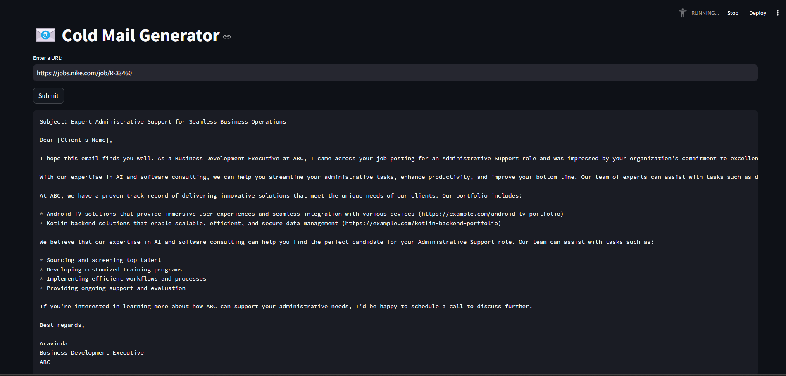

# 📧 Cold Email Generator

This tool is designed for service-oriented companies to streamline their outreach through cold emails. Using Groq, LangChain, and Streamlit, this application lets users input the URL of a company's careers page, extracts job postings from that page, and generates customized cold emails. Each email includes relevant portfolio links, drawn from a vector database, based on the specific job descriptions listed.

---

**Example Scenario:**

Imagine a large brand, such as a well-known sportswear company, is seeking a Principal Software Engineer and investing considerable resources in recruiting, onboarding, and training for this role.

ABC a hypothetical software development company, can step in to fulfill this need by providing a dedicated software engineer. A business development executive from ABC, such as Aravinda, could then reach out to the sportswear brand through a cold email, tailored to showcase how ABC’s services can support the brand’s goals.




---

## Architecture Diagram

The following diagram illustrates the architecture of the tool, showing each component's role in generating tailored cold emails:


---

## Setup Instructions

To set up and run the Cold Email Generator, follow these steps:

1. **Generate an API Key**: Obtain an API key by visiting the [Groq API console](https://console.groq.com/keys). Copy your key and update the `GROQ_API_KEY` entry in `app/.env` with this key.

2. **Install Dependencies**: Run the following command to install the necessary libraries:
    ```bash
    pip install -r requirements.txt
    ```

3. **Run the Application**: Launch the application with Streamlit:
    ```bash
    streamlit run app/main.py
    ```
